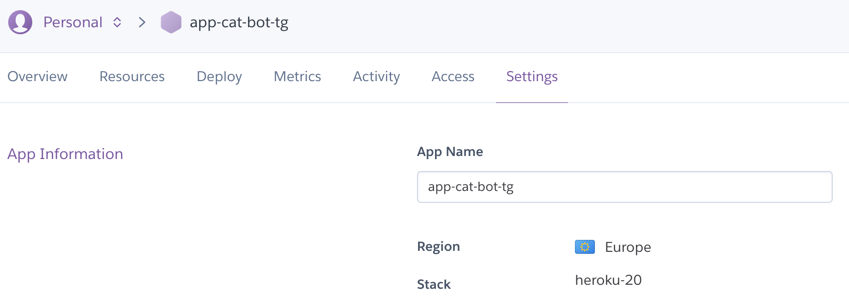
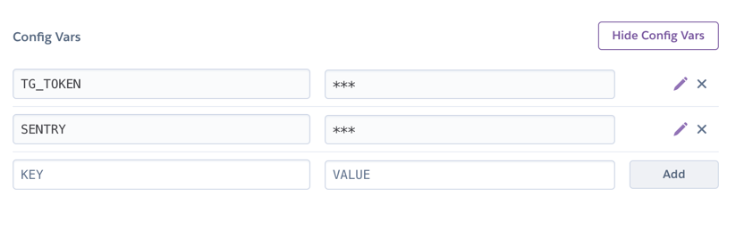

# Aiogram sentry heroku example

Для локального запуска достаточно:
```bash
pip install - r requirements.txt
python3 main.py
```

Чтобы задеплоить на Heroku у вас 2 варианта:
1. Через репозиторий на github 
   - Создать репозиторий на github с этим проектом
   - Выбрать в панели Heroku Deplyment method "Github"
    
   - Выбрать репозиторий с вашим проектом
2. Через Heroku Git
   - Установить Heroku CLI для своей ОС
   - ```bash
     heroku login
     heroku git:remote -a {Название приложения}
     git add .
     git commit -am "make it better"
     git push heroku master```

Далее, так как мы не хотим, чтобы наши токены были видны всем, заходим в панели управления Heroku в Settings:

Нажимаем Reveal Config Vars

И заводим 2 переменные: TG_TOKEN и SENTRY. В VALUE записываем токен нашего бота в телеграмме и ключ нашего проекта в сентри соответственно.



